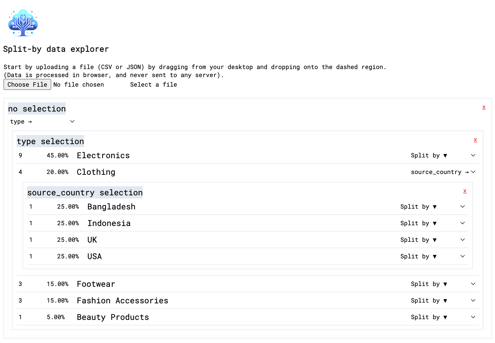
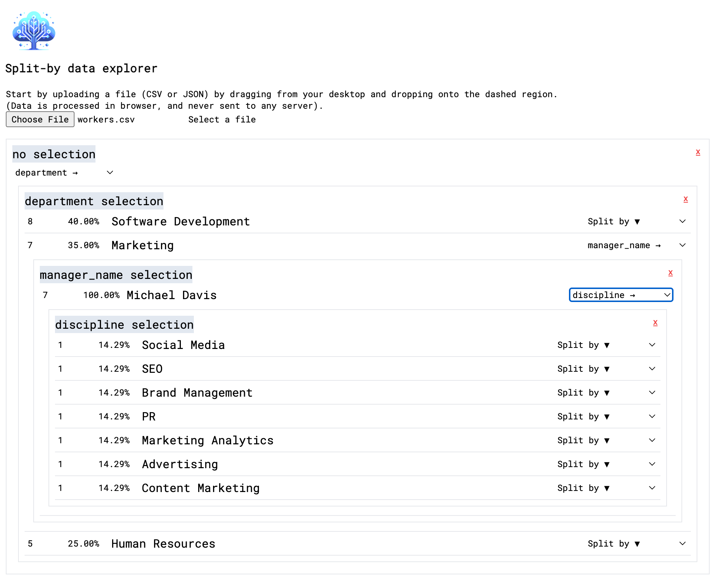

# `split-by-data-explorer` expects a CSV or JSON file as input data and allows the user to explore the data by splitting it into groups based on selected columns.

Deployed via GitHub actions at:
https://psychic-engine-63r2g9r.pages.github.io/

## Examples

#### Using samples/products.json:

Split by type > source_country

#### Using samples/workers.csv

Split by department > manager_name > discipline

